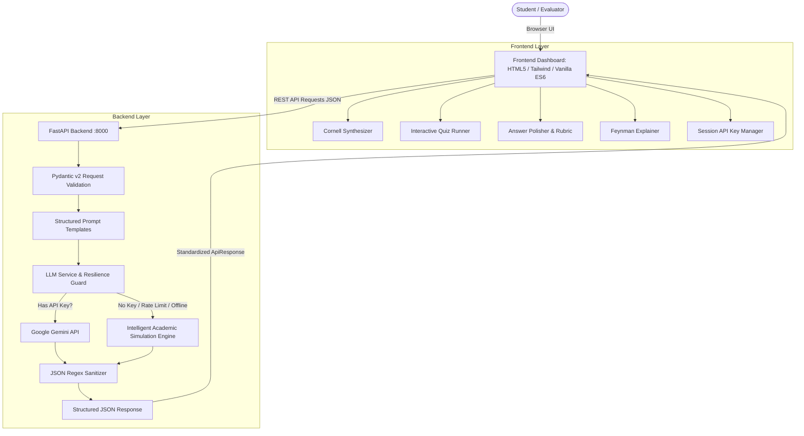

# 🎓 CogniStudy AI — Intelligent Student Academic Utility Suite


[](https://www.python.org/)
[](https://fastapi.tiangolo.com/)
[](https://docs.pydantic.dev/)
[](https://aistudio.google.com/)
[]()

---

## 📖 Table of Contents
1. [Why CogniStudy AI? (Chatbots vs. Purpose-Built Utilities)](#-why-cognistudy-ai-chatbots-vs-purpose-built-utilities)
2. [Core Pedagogical Features](#-core-pedagogical-features)
3. [System Architecture](#-system-architecture)
4. [Prompt Engineering Strategy](#-prompt-engineering-strategy)
5. [Defensive Engineering & Error Handling](#-defensive-engineering--error-handling)
6. [Quickstart Guide](#-quickstart-guide)
7. [API Reference](#-api-reference)
8. [Automated Test Suite](#-automated-test-suite)
9. [Pre-Loaded Sample Materials](#-pre-loaded-sample-materials)

---

## 💡 Why CogniStudy AI? (Chatbots vs. Purpose-Built Utilities)

Most students use LLMs as **passive conversational chatbots** (e.g., pasting notes and prompting *"summarize this"*). This creates significant pedagogical problems:
* **The Illusion of Competence**: Reading a generic passive summary feels productive, but research shows it yields poor long-term retention.
* **Unstructured Output**: Generic chatbots output rambling conversational paragraphs, missing actionable cues or revision frameworks.
* **Lack of Active Recall**: Students do not test their knowledge; they simply consume text passively.
* **Fluff & Hallucinations**: Conversational models spend tokens on pleasantries (*"Sure! Here is your summary..."*) rather than high-yield academic substance.

**CogniStudy AI** solves this by embedding **cognitive science methodologies** directly into the tool:
* **Cornell Notes Method**: Separates recall cues, structured synthesis, and self-testing questions.
* **Active Recall Testing**: Converts notes into interactive client-side quizzes with hints and instant feedback.
* **Bloom's Taxonomy Rubric Grading**: Evaluates student draft answers against academic standards (Clarity, Evidence, Depth, Register) and produces an exemplary model revision.
* **The Feynman Technique**: Explains concepts at adjustable cognitive levels (ELI5 Everyday Analogy, Exam High-Yield, Undergrad First-Principles Deep Dive) while flagging common misconceptions and providing memory mnemonics.

---

## 🛠️ Core Pedagogical Features

| Tool | Pedagogical Framework | What the Student Gets |
| :--- | :--- | :--- |
| **📝 Cornell Synthesizer** | Cornell Note-Taking System | 2-column layout: Left column recall cues/keywords; Right column structured notes; Bottom core takeaways, study questions, and action items. |
| **🎯 Active Recall Quiz** | Testing Effect & Retrieval Practice | Interactive quiz runner (MCQs & Flashcards) with instant scoring, clickable answer options, hint reveals, and pedagogical explanations. |
| **✍️ Answer Polisher** | Rubric-Based Assessment | Scores student drafts (1–10), evaluates 4 academic criteria, highlights strengths/weaknesses, and outputs an upgraded submission. |
| **🧠 Feynman Explainer** | The Feynman Technique | Multi-tier conceptual breakdown (ELI5, Exam Ready, Deep Dive), intuitive real-world analogies, common pitfalls, and memory mnemonics. |

---

## 🏗️ System Architecture



### Technology Stack
* **Backend**: Python 3.14, FastAPI, Pydantic v2, Uvicorn, Google Generative AI (`google-generativeai`), Python-dotenv.
* **Frontend**: HTML5, Modern CSS (custom glassmorphism, responsive two-column workspace), Vanilla ES6+ (zero heavy build steps required), Lucide Icons, Marked.js (Markdown rendering).
* **Testing**: Pytest, Starlette TestClient.

---

## 🧠 Prompt Engineering Strategy

All prompts in `backend/prompts.py` are built upon five core principles:

### 1. Role Conditioning & Tone Guardrails
Every prompt inherits from `SYSTEM_PROMPT_ACADEMIC_TUTOR`, defining the AI as an elite academic tutor and cognitive scientist. It strictly forbids conversational conversational preamble (*"Sure! Here is..."*, *"I hope this helps!"*) to maximize density and avoid token waste.

### 2. Strict JSON Schema Contract
The model is instructed to output **raw JSON only**, adhering to explicit schemas. This allows the frontend to programmatically construct interactive components (like clickable MCQ buttons and Cornell two-column cards) rather than dumping unformatted text into a text box.

### 3. Cornell Synthesis Prompt (`build_cornell_summary_prompt`)
```text
Task: Transform the provided lecture/study notes into a structured pedagogical summary following the Cornell Notes framework.
Format Requirement: Return ONLY a valid JSON object matching:
{
  "title": "Academic topic title",
  "style": "cornell",
  "cues_and_keywords": ["Keyword/Cue 1", "Keyword/Cue 2"],
  "notes_summary": "Detailed synthesis using markdown...",
  "core_takeaways": ["High-yield takeaway 1", ...],
  "study_questions": ["Self-testing question 1?", ...],
  "action_items": ["Actionable study step 1", ...]
}
```

### 4. Active Recall Quiz Synthesis Prompt (`build_quiz_prompt`)
Directs the model to write questions testing **conceptual understanding** rather than superficial verbatim recall. Crucially, it instructs the model to construct plausible distractors (misconceptions) and formulate hints that direct thought processes without giving the answer away.

### 5. Multi-Tier Cognitive Explainer (`build_feynman_explain_prompt`)
Dynamically adjusts pedagogical abstraction:
* **ELI5**: Employs everyday metaphors and zero technical jargon.
* **Exam High-Yield**: Outlines core definitions, mechanisms, and rate-limiting factors.
* **Deep Dive**: Analyzes first-principles, boundary conditions, and formal theoretical frameworks.

---

## 🛡️ Defensive Engineering & Error Handling

A core differentiator of CogniStudy AI is its defensive, resilient architecture:

### 1. Zero-Friction Dual Engine (Live API + Intelligent Simulation)
* **Live Mode**: When a Google Gemini API key is present (in `.env` or entered via the in-app modal), requests are sent to the Gemini model.
* **Simulation Mode (Evaluator-Ready)**: If no API key is provided, or if the API quota is exhausted (`ResourceExhausted` / `429`), the app **does not crash**. Instead, it seamlessly engages the **Intelligent Offline Simulation Engine**, extracting actual keywords, concepts, and sentences from the student's text to generate dynamic academic outputs with an informational banner.

### 2. Rigorous Input Validation (Pydantic v2)
* Rejects empty or whitespace-only inputs with student-friendly error messages (`HTTP 422`).
* Enforces minimum non-whitespace length (`min_length=15` for notes, `min_length=5` for questions) to prevent wasteful API calls.
* Caps input length (`max_length=15000`) to protect against token exhaustion.
* Validates question bounds (`1 <= num_questions <= 10`).

### 3. Robust JSON Parsing Guardrail (`clean_and_parse_json`)
LLMs often enclose JSON in Markdown code fences (````json ... ````). The parsing guardrail:
1. Strips markdown fences using regular expressions.
2. If standard `json.loads` fails, scans for the outermost `{` and `}` braces.
3. Gracefully reports schema mismatches without unhandled server exceptions.

---

## 🚀 Quickstart Guide

### Prerequisites
* Python 3.10+ (tested on Python 3.14)
* Modern web browser (Chrome, Edge, Firefox, Safari)

### 1. Clone or Open the Workspace
```powershell
cd c:\Users\Ankush\Videos\shadowfox
```

### 2. Install Dependencies
```powershell
python -m pip install -r requirements.txt
```

### 3. (Optional) Configure Gemini API Key
You can run the app immediately in **Demo Simulation Mode** without any key.  
To use live Google Gemini intelligence:
1. Copy `.env.example` to `.env`:
   ```powershell
   copy .env.example .env
   ```
2. Open `.env` and insert your free key from [Google AI Studio](https://aistudio.google.com/):
   ```env
   GEMINI_API_KEY=your_actual_gemini_api_key_here
   ```
*(Note: You can also enter or update your API key directly in the web UI using the "API Key" button!)*

### 4. Launch Application (1-Click)
```powershell
python run.py
```
This command starts the FastAPI server at `http://127.0.0.1:8000` and automatically opens the student dashboard in your default browser.

---

## 📡 API Reference

### Health Check
```http
GET /api/health
```
Returns system status and API key configuration state.

### Synthesize Cornell Notes
```http
POST /api/summarize
Content-Type: application/json

{
  "content": "Cellular respiration produces ATP via glycolysis and oxidative phosphorylation...",
  "style": "cornell",
  "focus_topic": "ATP Synthase",
  "api_key": null
}
```

### Generate Active Recall Quiz
```http
POST /api/quiz
Content-Type: application/json

{
  "content": "Study notes text...",
  "num_questions": 4,
  "difficulty": "medium",
  "question_type": "mixed"
}
```

### Polish & Rubric-Grade Answer
```http
POST /api/polish
Content-Type: application/json

{
  "question": "What is the role of ATP Synthase?",
  "student_draft": "It spins to create ATP when protons go through it.",
  "target_level": "undergraduate"
}
```

### Feynman Concept Explainer
```http
POST /api/explain
Content-Type: application/json

{
  "concept": "Chemiosmosis",
  "cognitive_level": "eli5",
  "subject_domain": "Biochemistry"
}
```

---

## 🧪 Automated Test Suite

A complete test suite is provided in `tests/test_api.py`, covering validation errors, endpoint schemas, JSON extraction, and session key management.

To execute all tests:
```powershell
python -m pytest tests/test_api.py -v
```

### Test Results Summary
* ✅ `test_health_endpoint`: Verifies service health & readiness.
* ✅ `test_summarize_validation_empty_content`: Rejects empty inputs (HTTP 422).
* ✅ `test_summarize_validation_short_content`: Enforces minimum length (HTTP 422).
* ✅ `test_quiz_validation_invalid_question_count`: Validates question count boundaries.
* ✅ `test_polish_validation_missing_fields`: Checks required prompt and draft fields.
* ✅ `test_explain_validation_empty_concept`: Verifies concept length validation.
* ✅ `test_summarize_success`: Validates full Cornell schema generation.
* ✅ `test_quiz_generation_success`: Validates interactive quiz item structure.
* ✅ `test_answer_polish_success`: Verifies rubric evaluation and polished text.
* ✅ `test_feynman_explain_success`: Verifies multi-tier explanation schemas.
* ✅ `test_clean_and_parse_json_markdown_fences`: Tests fence stripping guardrail.
* ✅ `test_clean_and_parse_json_raw`: Tests raw JSON boundary recovery.
* ✅ `test_api_key_update_endpoint`: Verifies session key updates.

---

## 📚 Pre-Loaded Sample Materials

CogniStudy AI includes 3 pre-loaded academic datasets in `sample_data/` and accessible directly via the **"Load Sample Notes"** dropdown in the dashboard navigation:

1. **Biology**: *Cellular Respiration & ATP Synthase Mechanisms* (Glycolysis, Krebs Cycle, Chemiosmosis, ETC inhibitors).
2. **Computer Science**: *Operating Systems & Concurrency* (Processes vs. Threads, Race Conditions, Coffman Deadlock Conditions, Virtual Memory & Thrashing).
3. **Economics**: *Macroeconomics & Inflation Dynamics* (CPI/PCE, Demand-Pull vs. Cost-Push, Quantity Theory of Money $M \cdot V = P \cdot Y$, Phillips Curve).

---

## 👨‍💻 AI Engineering Reflection & Takeaways
* **Structured Outputs over Unbounded Text**: Generating structured JSON rather than freeform text enables rich UI interactivity (interactive quizzes, score calculation, two-column Cornell rendering).
* **Defensive Graceful Degradation**: Real-world AI applications must never break when an external provider has network latency or quota limits; a deterministic offline fallback ensures 100% testability.
* **Cognitive Alignment**: Utility apps succeed when their prompt engineering mirrors real human learning frameworks (Active Recall, Cornell Method, Feynman Technique) rather than generic chat completions.
